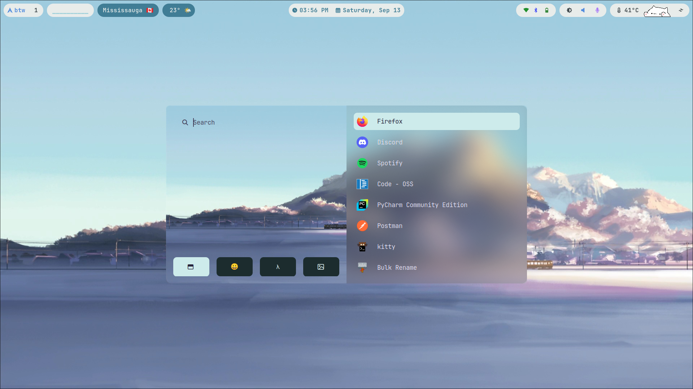
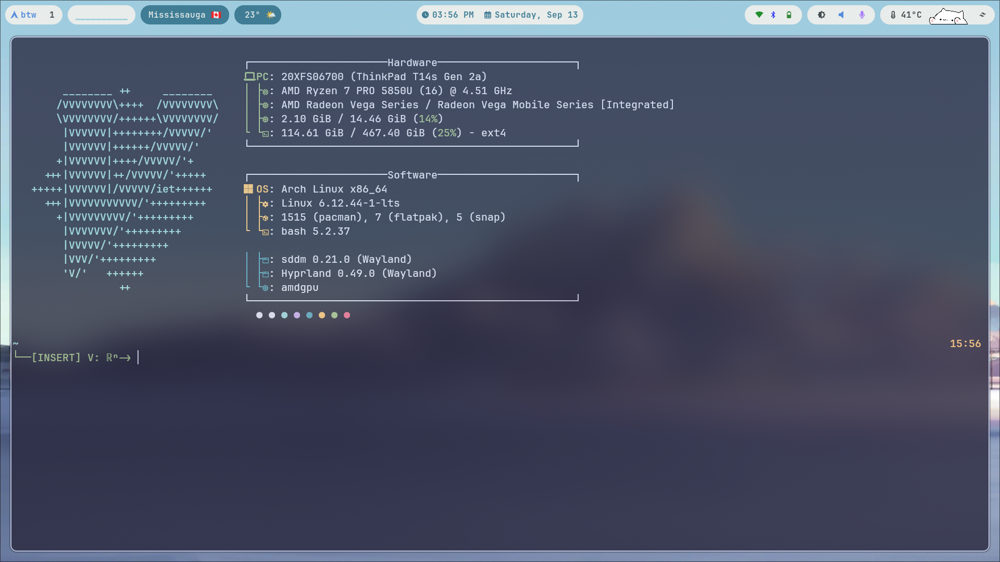
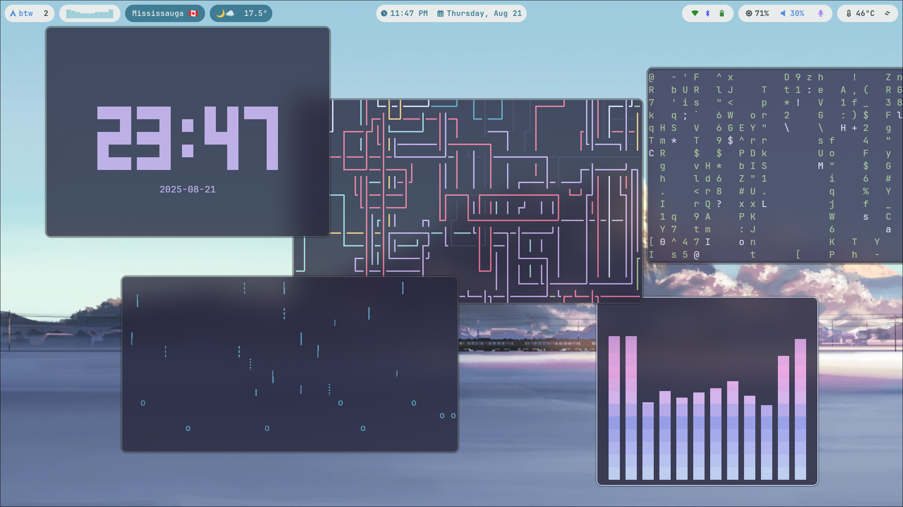
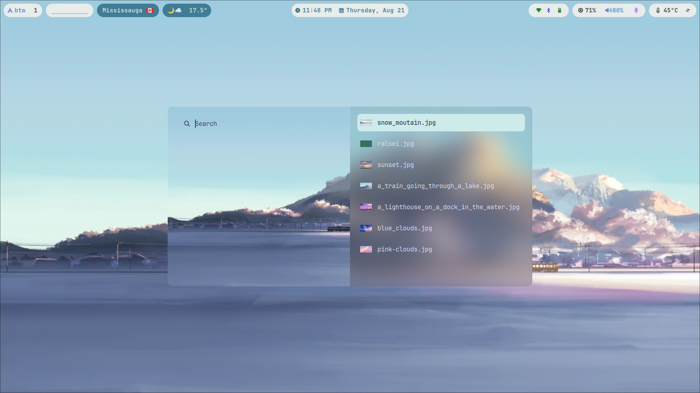
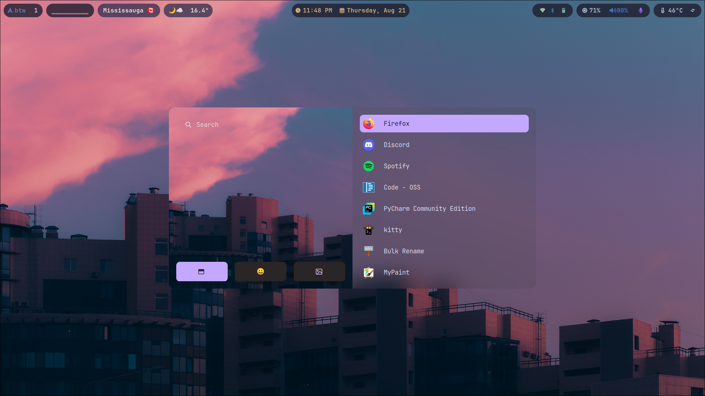
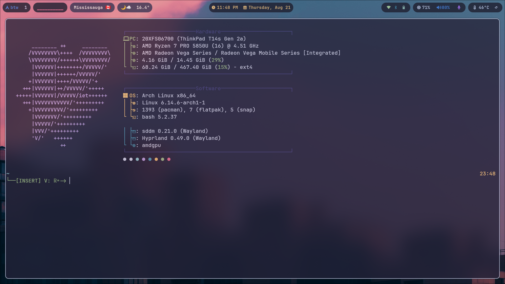
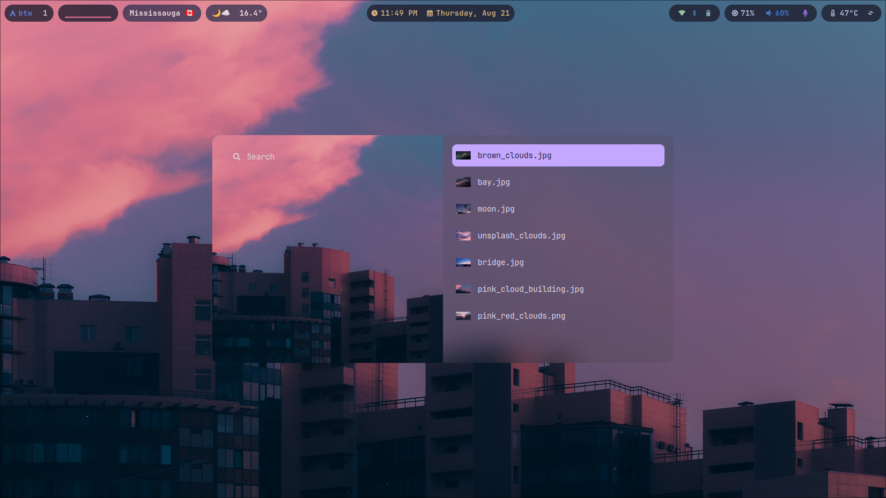

# Jason's Hyprland dot files 

My Arch Linux Hyprland setup. 

To use the weather app, please generate your own OpenWeatherMap API key and put it in ~/.config/waybar/scripts/.env as WEATHER_KEY

I will be working on install.sh script to download my hyprland easier 

Wallpapers are in ```/hypr/wallpapers/themes/```

## Packages 
[Waybar](https://github.com/Alexays/Waybar)
[Bongocat](https://github.com/saatvik333/wayland-bongocat)
[Rofi Menu](https://github.com/davatorium/rofi) 
[Fastfetch](https://github.com/fastfetch-cli/fastfetch)
[Terminal Prompt](https://github.com/starship/starship)

## CLI Arts 
[Pipes](https://github.com/pipeseroni/pipes.sh)
[Audio Visualizer](https://github.com/karlstav/cava)
[Rain](https://github.com/k-blo/rainfall)
[Clock](https://github.com/xorg62/tty-clock)
[Cmatrix](https://github.com/abishekvashok/cmatrix)


## Preview 

### Light Mode 






### Dark Mode 






